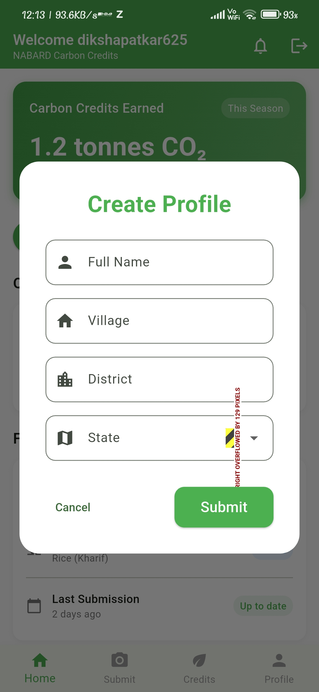
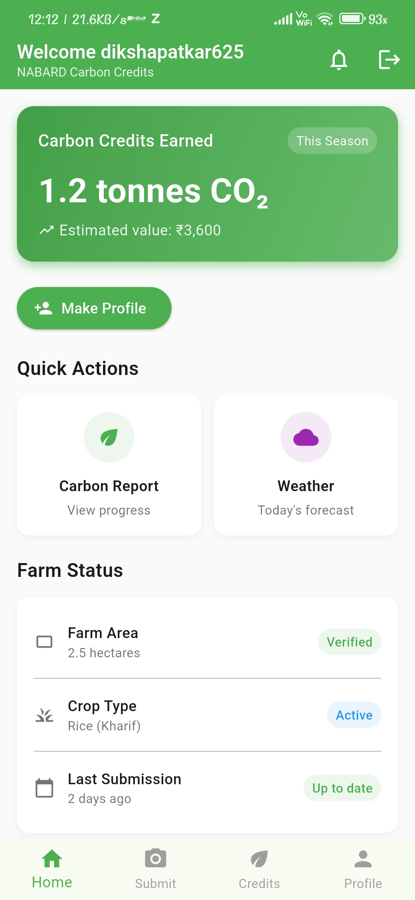
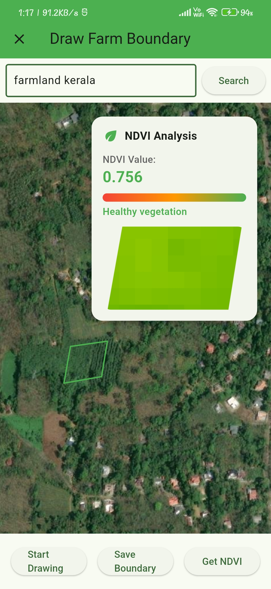
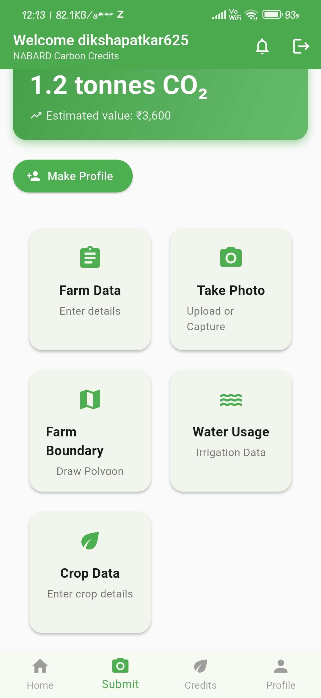
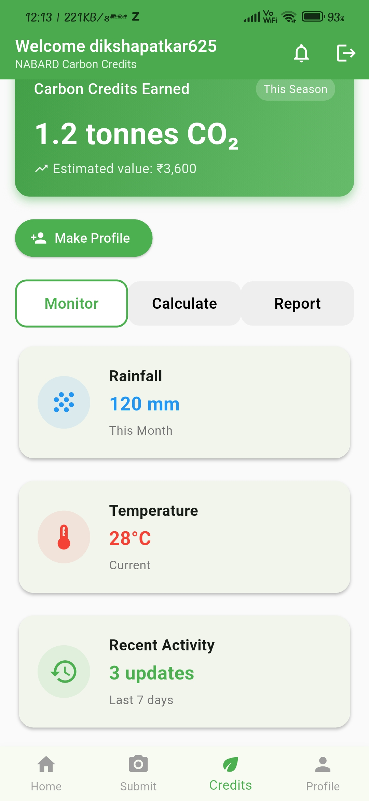
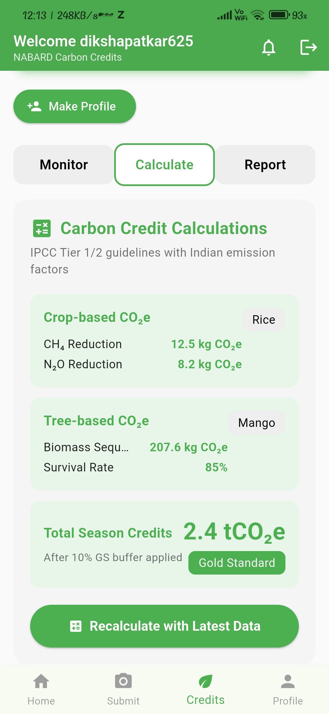
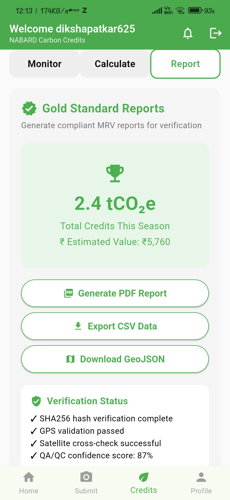

# KrushiMitra - NABARD Carbon Credits App

A cross-platform, open-source Flutter application that democratizes carbon credit access for India’s 146 million smallholder farmers by providing the first affordable, scalable MRV (Monitoring, Reporting, Verification) system tailored for fragmented agricultural landscapes.

## Brief Description

Current MRV systems are too expensive and complex for small farms, making carbon credits inaccessible. Our solution flips this model: farmers use a simple mobile app to collect data, while free satellite imagery and automated backend analysis provide continuous, low-cost verification. This reduces transaction costs by up to 80%, enabling even 1-acre farms to participate in carbon markets and earn new income streams.

## Technology Stack
- **Mobile:** Flutter/Dart (cross-platform)
- **Backend:** Python Flask, Google Earth Engine (satellite/NDVI processing)
- **Database:** Supabase (farmer profiles, boundaries)
- **Auth:** Firebase
- **Mapping:** OpenStreetMap, flutter_map
- **APIs:** RESTful, real-time NDVI and carbon calculations

## Prototype Overview
- **Farmers register and create a profile** (name, village, crop type)
- **Interactive farm boundary mapping** using tap-to-trace on satellite imagery
- **Evidence collection:** geotagged photos, voice notes, offline-first data capture
- **AI-powered validation:** combines satellite NDVI with farmer data, shows confidence scores (traffic-light indicators)
- **Automated carbon credit calculations** using IPCC-compliant methods and Indian emission factors
- **Quality assurance:** flags errors, supports human review with side-by-side satellite and field data
- **End-to-end workflow:** registration → mapping → data collection → validation → calculation → reporting

## Key Features & Innovations
- **Complete MRV Pipeline:** Monitor, Calculate, Report tabs for full carbon workflow
- **Advanced Satellite Integration:** Real-time NDVI analysis, Google Earth Engine backend
- **Interactive Mapping:** Draw farm boundaries, search locations, save polygons to Supabase
- **Carbon Credit Engine:** IPCC Tier 1/2, crop/tree-based CO₂e, Gold Standard references
- **Comprehensive Data Collection:** Photos, voice, quick field data, seasonal tracking
- **Farmer-Centric:** Data ownership, voice-first UI, offline support, no MRV fees for farmers
- **Open-Source & Scalable:** Designed for rapid scale-up, low cost, and broad accessibility

## Intended Users
Smallholder farmers across India practicing sustainable agriculture, agroforestry, or climate-smart farming, who are currently excluded from carbon markets due to high verification costs and technical barriers.

## What Makes This Unique?
- **Farmer-first:** Data ownership, direct benefits, no MRV fees
- **Open-source:** Uses free satellite data and open tools, not proprietary systems
- **Offline & Voice-first:** Designed for rural, low-literacy, low-connectivity environments
- **Platform-agnostic:** Can be used by any farmer, not tied to a supply chain or corporate program
- **Scalable:** Automated, low-cost, and ready for millions of users

## Impact & Scalability
- Enables 146 million Indian smallholder farmers to join carbon markets
- Reduces MRV costs by up to 80%
- Turns agriculture (18% of India’s emissions) into a carbon sink
- Provides new income for rural communities
- Scalable, open, and ready for rapid adoption

## Getting Started

### Prerequisites
- [Flutter SDK](https://flutter.dev/docs/get-started/install)
- Dart
- Android Studio or VS Code (recommended)
- Firebase/Supabase credentials (if using backend features)

### Installation
1. Clone the repository:
   ```bash
   git clone https://github.com/chiragvispute/nabard-hackathon.git
   cd nabard-hackathon
   ```
2. Install dependencies:
   ```bash
   flutter pub get
   ```
3. Configure Firebase/Supabase if required (see `lib/services/` and `firebase.json`).
4. Run the app:
   ```bash
   flutter run
   ```

## Project Structure
- `lib/`
  - `main.dart` – App entry point
  - `home_screen.dart` – Main dashboard and navigation
  - `screens/` – All feature screens (submit, credits, monitor, report, etc.)
  - `services/` – Backend and authentication services
- `android/`, `ios/`, `web/`, `linux/`, `macos/`, `windows/` – Platform-specific code

## Screenshots & Demo

### 📱 App Screenshots

- **Login & Profile Creation:**  
    
  _User authentication and profile setup._

- **Home Dashboard:**  
    
  _Carbon credits summary, quick actions, farm status, and recent activity._

- **Farm Boundary Mapping:**  
    
  _Interactive map for drawing and saving farm boundaries and NDVI reports._

- **Submit Data:**  
    
  _Submit farm data, photos, water usage, and crop details._

- **Credits & Reports:**  
    
  _Monitor real time farm data carbon ._
    
  _Calculate carbon credits._
    
  _View the report and export option ._

---

### 🎥 Demo Video

- [Watch the full demo video here](https://your-demo-link.com)  
  _A step-by-step walkthrough of all features and workflows._

---

**Developed by Team Codechamps**
